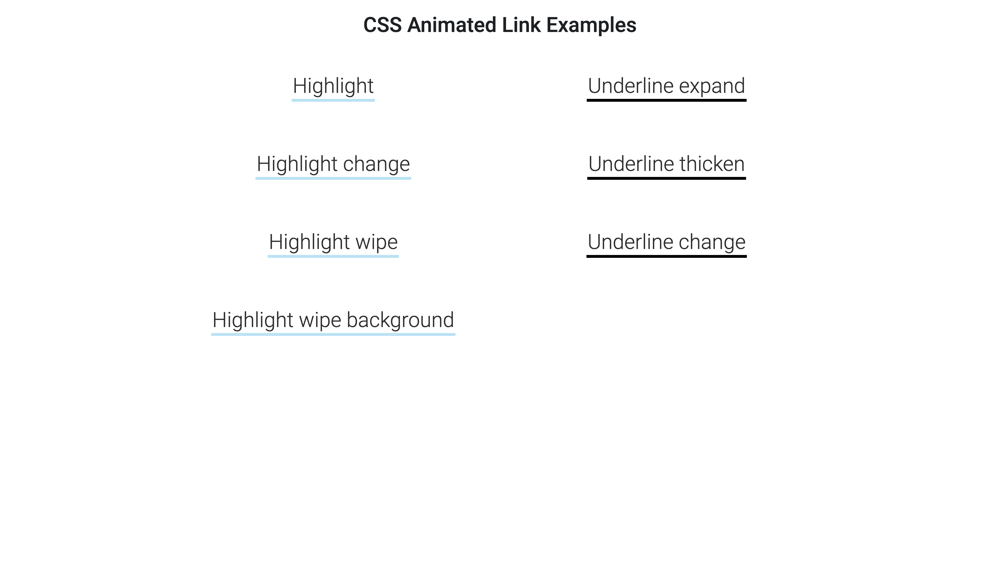

# CSS Animated Link Examples

## Table of Contents

- [CSS Animated Link Examples](#css-animated-link-examples)
  - [Table of Contents](#table-of-contents)
  - [Description](#description)
  - [Demo](#demo)
  - [Author](#author)
  - [License](#license)

## Description

A collection of pure CSS animated link styles featuring various visual effects such as colour changes, underline thickness, background wipes, and highlights, all with smooth transitions.

## Demo

See the demo on CodePen: [CSS Animated Link Examples](https://codepen.io/karlhorning/pen/mybMqXg)

## Author

Karl Horning

- [GitHub](https://github.com/Karl-Horning/)
- [LinkedIn](https://www.linkedin.com/in/karl-horning/)
- [CodePen](https://codepen.io/karlhorning)

## License

This repository is licensed under the [MIT License](LICENSE).
