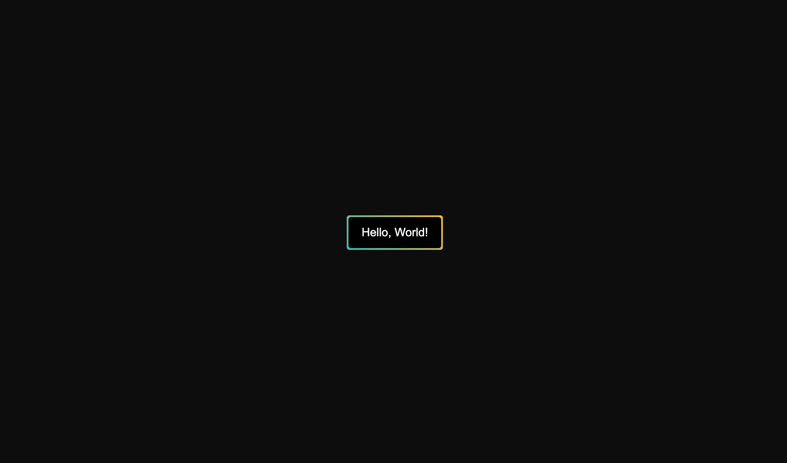

# CSS Button Gradient Animation

## Table of Contents

- [CSS Button Gradient Animation](#css-button-gradient-animation)
  - [Table of Contents](#table-of-contents)
  - [Description](#description)
  - [Demo](#demo)
  - [Author](#author)
  - [License](#license)

## Description

A button with a dynamic, rotating gradient border that animates on hover. It's centred on the page using Flexbox and includes smooth transitions for hover and active states, featuring a scaling effect.

## Demo

[View the live demo on CodePen](https://codepen.io/karlhorning/pen/qEWPgGq).

## Author

Karl Horning

- [GitHub](https://github.com/Karl-Horning/)
- [LinkedIn](https://www.linkedin.com/in/karl-horning/)
- [CodePen](https://codepen.io/karlhorning)

## License

This repository is licensed under the [MIT License](LICENSE).
