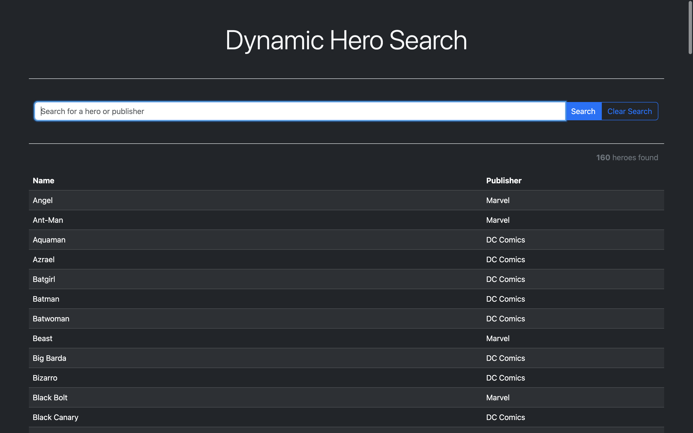

# Dynamic Hero Search

## Table of Contents

- [Dynamic Hero Search](#dynamic-hero-search)
  - [Table of Contents](#table-of-contents)
  - [Overview](#overview)
  - [Demo](#demo)
  - [Acknowledgments](#acknowledgments)
  - [Author](#author)
  - [License](#license)

## Overview

Dark-themed superhero search and filter application using CSS and JavaScript. Features real-time search, dynamic table updates, clear functionality, and alphabetised sorting. Includes accessibility enhancements and automatic copyright updates based on the current year.

## Demo

Check out the live demo on CodePen: [Dynamic Hero Search Demo](https://codepen.io/karlhorning/pen/dyrMzWy)

## Acknowledgments

This project uses the following resources:

- [Bootstrap](https://getbootstrap.com) - Front-end framework for developing responsive and mobile-first websites.
- Special thanks to [CodePen](https://codepen.io) for providing a platform to showcase and share web development projects.

## Author

Karl Horning

- [GitHub](https://github.com/Karl-Horning/)
- [LinkedIn](https://www.linkedin.com/in/karl-horning/)
- [CodePen](https://codepen.io/karlhorning)

## License

This repository is licensed under the [MIT License](LICENSE).
