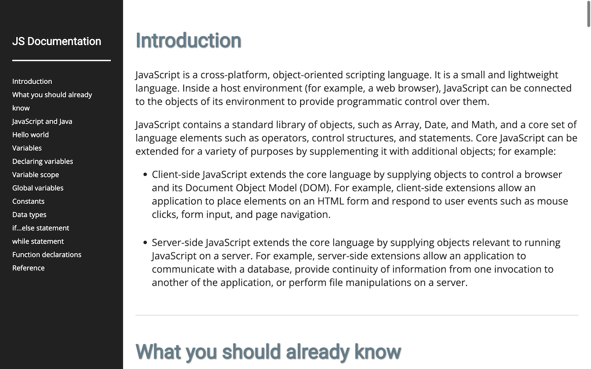

# freeCodeCamp: Build a Technical Documentation Page

## Table of Contents

- [freeCodeCamp: Build a Technical Documentation Page](#freecodecamp-build-a-technical-documentation-page)
  - [Table of Contents](#table-of-contents)
  - [Description](#description)
  - [Demo](#demo)
  - [Acknowledgments](#acknowledgments)
  - [Author](#author)
  - [License](#license)

## Description

This project is a Technical Documentation Page developed for the Responsive Web Design Projects on freeCodeCamp. It features a structured layout with multiple sections dedicated to specific topics and a user-friendly navigation menu.

This project fulfils the following user stories:

- [x] **User Story #1:** Display a main element with the ID "main-doc" containing technical documentation.
- [x] **User Story #2:** Include several section elements with the class "main-section," each with a header describing the topic.
- [x] **User Story #3:** Provide navigation with a navbar containing links corresponding to each main section.
- [x] **User Story #4:** Implement responsiveness, ensuring an optimal viewing experience on various devices.
- [x] **User Story #5:** Clicking on a navbar link navigates to the corresponding section in the main documentation.

## Demo

A live demo of this project is available on CodePen: [Technical Documentation Page Demo](https://codepen.io/karlhorning/pen/pxgybR)

## Acknowledgments

This project uses the following resource:

- [CSS-only (dynamic) line numbers](https://codepen.io/elomatreb/pen/hbgxp): A reference used for implementing dynamic line numbers in the code sections.

## Author

Karl Horning

- [GitHub](https://github.com/Karl-Horning/)
- [LinkedIn](https://www.linkedin.com/in/karl-horning/)
- [CodePen](https://codepen.io/karlhorning)

## License

This repository is licensed under the [MIT License](LICENSE).
