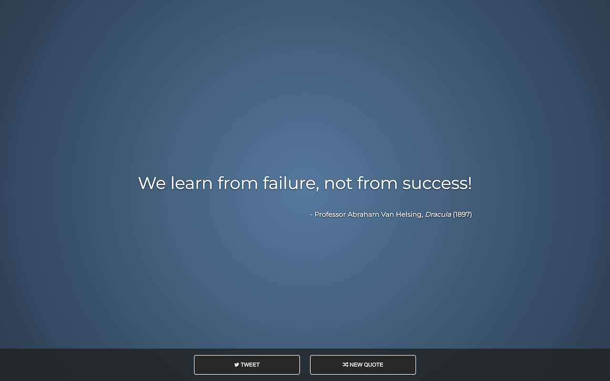

# freeCodeCamp: Random Quote Machine

## Table of Contents

- [freeCodeCamp: Random Quote Machine](#freecodecamp-random-quote-machine)
  - [Table of Contents](#table-of-contents)
  - [Description](#description)
  - [Demo](#demo)
  - [Acknowledgments](#acknowledgments)
  - [Author](#author)
  - [License](#license)

## Description

The Random Quote Machine is a web application developed as part of the freeCodeCamp curriculum. The main goal of this project is to create a simple and interactive page that displays random quotes along with their sources. Users can also tweet their favourite quotes directly from the application.

## Demo

View the live demo on CodePen: [Random Quote Machine](https://codepen.io/karlhorning/pen/zKewaN)

## Acknowledgments

This project uses the following resources:

- Font Awesome icons.
- Montserrat font from Google Fonts.
- BootstrapCDN.

## Author

Karl Horning

- [GitHub](https://github.com/Karl-Horning/)
- [LinkedIn](https://www.linkedin.com/in/karl-horning/)
- [CodePen](https://codepen.io/karlhorning)

## License

This repository is licensed under the [MIT License](LICENSE).
