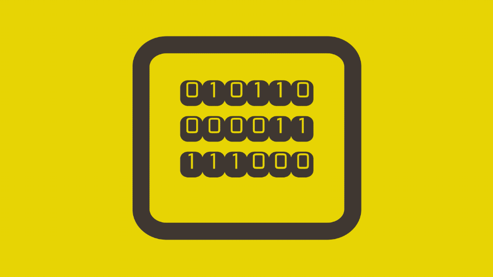

# HTML & CSS Binary Clock

## Table of Contents

- [HTML \& CSS Binary Clock](#html--css-binary-clock)
  - [Table of Contents](#table-of-contents)
  - [Description](#description)
  - [Demo](#demo)
  - [Acknowledgments](#acknowledgments)
  - [Author](#author)
  - [License](#license)

## Description

This project is a binary clock implemented using HTML, CSS, and JavaScript. It displays the current time in a binary format.

## Demo

[View the live demo on CodePen](https://codepen.io/karlhorning/pen/PBGLXj).

## Acknowledgments

This project uses the following resource:

- ["Monofett" from Google Fonts](https://fonts.googleapis.com/css?family=Monofett)

## Author

Karl Horning

- [GitHub](https://github.com/Karl-Horning/)
- [LinkedIn](https://www.linkedin.com/in/karl-horning/)
- [CodePen](https://codepen.io/karlhorning)

## License

This repository is licensed under the [MIT License](LICENSE).
