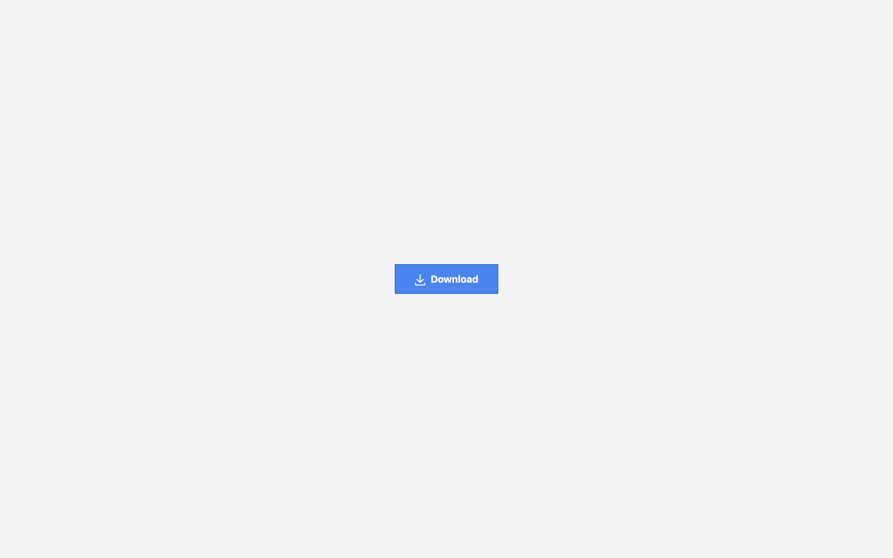

# JavaScript & CSS Animated Download Button

## Table of Contents

- [JavaScript \& CSS Animated Download Button](#javascript--css-animated-download-button)
  - [Table of Contents](#table-of-contents)
  - [Description](#description)
  - [Demo](#demo)
  - [Acknowledgments](#acknowledgments)
  - [Author](#author)
  - [License](#license)

## Description

A button with a ripple effect on click and a downward arrow animation on hover. The ripple is animated with CSS keyframes, and the effect disappears after the animation, while JavaScript handles the ripple creation and cleanup.

## Demo

Check out the live demo on CodePen: [Animated Download Button](https://codepen.io/karlhorning/pen/gOErPxg)

## Acknowledgments

This project uses the following resources:

- [Tailwind CSS](https://tailwindcss.com/) - Used for styling
- [CodePen](https://codepen.io/) - Hosting the live demo

## Author

Karl Horning

- [GitHub](https://github.com/Karl-Horning/)
- [LinkedIn](https://www.linkedin.com/in/karl-horning/)
- [CodePen](https://codepen.io/karlhorning)

## License

This repository is licensed under the [MIT License](LICENSE).
