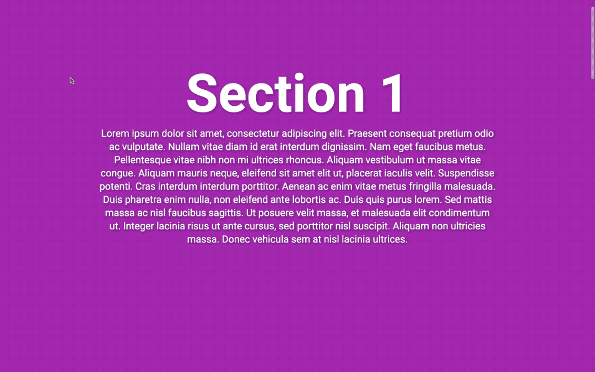

# JavaScript & CSS Changing Background Colour on Scroll

## Table of Contents

- [JavaScript \& CSS Changing Background Colour on Scroll](#javascript--css-changing-background-colour-on-scroll)
  - [Table of Contents](#table-of-contents)
  - [Description](#description)
  - [Demo](#demo)
  - [Acknowledgments](#acknowledgments)
  - [Author](#author)
  - [License](#license)

## Description

Dynamic background colour transition on scroll using JavaScript and CSS. The page's background updates to match the "data-color" attribute of each section as the user scrolls.

## Demo

[View the live demo on CodePen](https://codepen.io/karlhorning/pen/QWojGpW).

## Acknowledgments

This project uses the following resources:

- [Jack Harner's](https://codepen.io/jackharner/) original project on [CodePen](https://codepen.io/jackharner/pen/bdPmQM)
- ["Share Tech Mono" from Google Fonts](https://fonts.googleapis.com/css?family=Share+Tech+Mono)

## Author

Karl Horning

- [GitHub](https://github.com/Karl-Horning/)
- [LinkedIn](https://www.linkedin.com/in/karl-horning/)
- [CodePen](https://codepen.io/karlhorning)

## License

This repository is licensed under the [MIT License](LICENSE).
