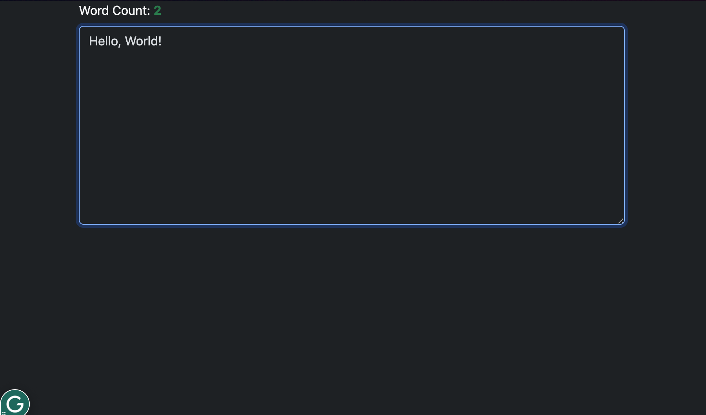

# JavaScript Word Count

## Table of Contents

- [JavaScript Word Count](#javascript-word-count)
  - [Table of Contents](#table-of-contents)
  - [Description](#description)
  - [Demo](#demo)
  - [Acknowledgments](#acknowledgments)
  - [Author](#author)
  - [License](#license)

## Description

A simple web application to count the number of words in a textarea, built using HTML, Bootstrap (for the example front end), and JavaScript.

## Demo

View the demo on [CodePen](https://codepen.io/karlhorning/pen/NPKyEYB).

## Acknowledgments

This project uses the following resource:

- [Bootstrap](https://getbootstrap.com) - Front-end framework used for styling.

## Author

Karl Horning

- [GitHub](https://github.com/Karl-Horning/)
- [LinkedIn](https://www.linkedin.com/in/karl-horning/)
- [CodePen](https://codepen.io/karlhorning)

## License

This repository is licensed under the [MIT License](LICENSE).
