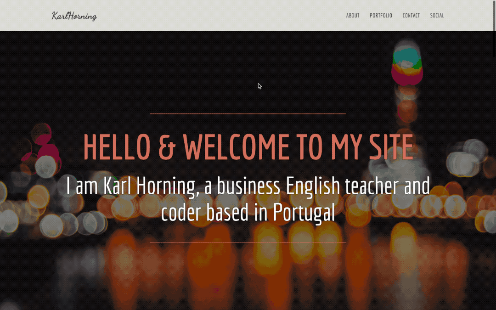

# Karl Horning's Portfolio

## Table of Contents

- [Karl Horning's Portfolio](#karl-hornings-portfolio)
  - [Table of Contents](#table-of-contents)
  - [Description](#description)
  - [Demo](#demo)
  - [Author](#author)
  - [License](#license)

## Description

This project showcases my skills and projects as a business English teacher and coder based in Portugal. The website features various sections including an about me page, portfolio, contact form, and social links.

## Demo

[View the live demo on CodePen](https://codepen.io/karlhorning/pen/GjoZzq).

## Author

Karl Horning

- [GitHub](https://github.com/Karl-Horning/)
- [LinkedIn](https://www.linkedin.com/in/karl-horning/)
- [CodePen](https://codepen.io/karlhorning)

## License

This repository is licensed under the [MIT License](LICENSE).
