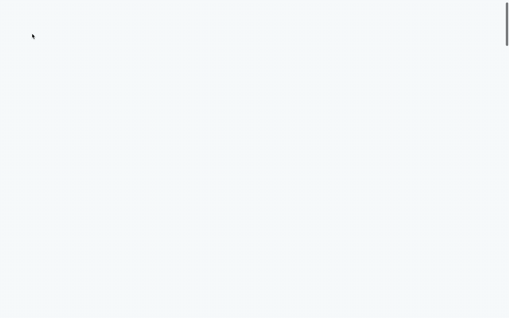

# freeCodeCamp Responsive Web Design Projects - Build a Personal Portfolio Webpage

## Table of Contents

- [freeCodeCamp Responsive Web Design Projects - Build a Personal Portfolio Webpage](#freecodecamp-responsive-web-design-projects---build-a-personal-portfolio-webpage)
  - [Table of Contents](#table-of-contents)
  - [Description](#description)
  - [Demo](#demo)
  - [Acknowledgments](#acknowledgments)
  - [Author](#author)
  - [License](#license)

## Description

This repository holds the source code for my 2019 portfolio website, designed to showcase my skills, projects, and experiences as a web developer. The portfolio is structured with a modern and responsive design, featuring CSS animations and media queries to ensure optimal viewing across various devices.

The project originated as part of the freeCodeCamp Responsive Web Design Projects, specifically the "Build a Personal Portfolio Webpage" challenge. It fulfils the following user stories:

- [x] **User Story #1:** My portfolio should have a welcome section with an id of welcome-section.
- [x] **User Story #2:** The welcome section should have an h1 element that contains text.
- [x] **User Story #3:** My portfolio should have a projects section with an id of projects.
- [x] **User Story #4:** The projects section should contain at least one element with a class of project-tile to hold a project.
- [x] **User Story #5:** The projects section should contain at least one link to a project.
- [x] **User Story #6:** My portfolio should have a navbar with an id of navbar.
- [x] **User Story #7:** The navbar should contain at least one link that I can click on to navigate to different sections of the page.
- [x] **User Story #8:** My portfolio should have a link with an id of profile-link, which opens my GitHub or FCC profile in a new tab.
- [x] **User Story #9:** My portfolio should have at least one media query.
- [x] **User Story #10:** The height of the welcome section should be equal to the height of the viewport.
- [x] **User Story #11:** The navbar should always be at the top of the viewport.

## Demo

[View the live demo on CodePen](https://codepen.io/karlhorning/pen/JjzdxbM).

## Acknowledgments

This project uses the following resources:

- [Normalize.css](https://necolas.github.io/normalize.css/)
- [How TO - CSS Arrows](https://www.w3schools.com/howto/howto_css_arrows.asp)
- [iHover](http://gudh.github.io/ihover/dist/)
- [Smooth Scrolling](https://css-tricks.com/snippets/jquery/smooth-scrolling/)

## Author

Karl Horning

- [GitHub](https://github.com/Karl-Horning/)
- [LinkedIn](https://www.linkedin.com/in/karl-horning/)
- [CodePen](https://codepen.io/karlhorning)

## License

This repository is licensed under the [MIT License](LICENSE).
