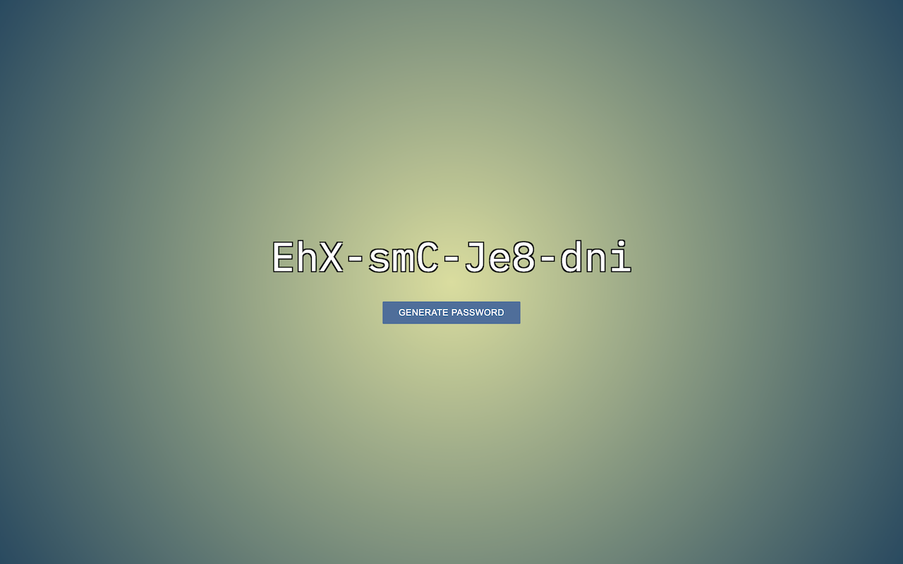

# Random Password Generator

## Table of Contents

- [Random Password Generator](#random-password-generator)
  - [Table of Contents](#table-of-contents)
  - [Overview](#overview)
  - [Demo](#demo)
  - [Acknowledgments](#acknowledgments)
  - [Author](#author)
  - [License](#license)

## Overview

This project is a random password generator designed to create unique passwords for users. It provides a user-friendly interface with a "Generate Password" button, allowing users to easily obtain passwords.

**Note:** This project was an earlier project and does not employ the latest security practices. Generating passwords in this way is not as secure as using modern password hashing and salting techniques. If you are working on a production system, use established authentication libraries and frameworks.

## Demo

[View the live demo on CodePen](https://codepen.io/karlhorning/pen/XBNaWw).

## Acknowledgments

This project uses the following resource:

- ["IBM Plex Mono" from Google Fonts](https://fonts.googleapis.com/css?family=IBM+Plex+Mono)

## Author

Karl Horning

- [GitHub](https://github.com/Karl-Horning/)
- [LinkedIn](https://www.linkedin.com/in/karl-horning/)
- [CodePen](https://codepen.io/karlhorning)

## License

This repository is licensed under the [MIT License](LICENSE).
