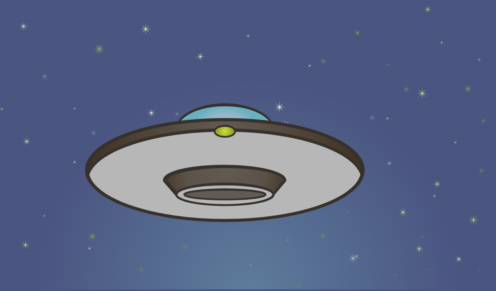

# SVG & CSS Animated UFO

## Table of Contents

- [SVG \& CSS Animated UFO](#svg--css-animated-ufo)
  - [Table of Contents](#table-of-contents)
  - [Description](#description)
  - [Demo](#demo)
  - [Author](#author)
  - [License](#license)

## Description

A CSS animation of an SVG UFO. A grid layout centres the content, while the UFO and stars are animated with keyframes.

## Demo

[View the live demo on CodePen](https://codepen.io/karlhorning/pen/EBzYrL).

## Author

Karl Horning

- [GitHub](https://github.com/Karl-Horning/)
- [LinkedIn](https://www.linkedin.com/in/karl-horning/)
- [CodePen](https://codepen.io/karlhorning)

## License

This repository is licensed under the [MIT License](LICENSE).
