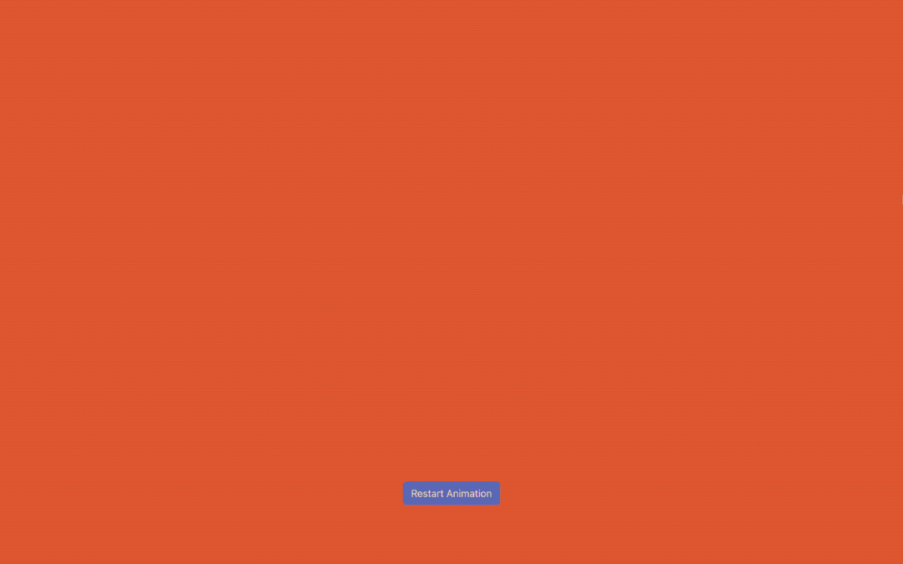

# SVG Vivus Animation

## Table of Contents

- [SVG Vivus Animation](#svg-vivus-animation)
  - [Table of Contents](#table-of-contents)
  - [Description](#description)
  - [Demo](#demo)
  - [Acknowledgments](#acknowledgments)
  - [Author](#author)
  - [License](#license)

## Description

An SVG animation of "Hello World" created using the Vivus library, featuring a "Restart Animation" button that allows users to replay the animation after it has completed.

## Demo

Check out the live demo on [CodePen](https://codepen.io/karlhorning/pen/OJqoKoO).

## Acknowledgments

This project uses the following resources:

- [Bootstrap](https://getbootstrap.com)
- [Don Graffiti font](https://www.dafont.com/don-graffiti.font)
- [Vivus](https://github.com/maxwellito/vivus)

## Author

Karl Horning

- [GitHub](https://github.com/Karl-Horning/)
- [LinkedIn](https://www.linkedin.com/in/karl-horning/)
- [CodePen](https://codepen.io/karlhorning)

## License

This repository is licensed under the [MIT License](LICENSE).
